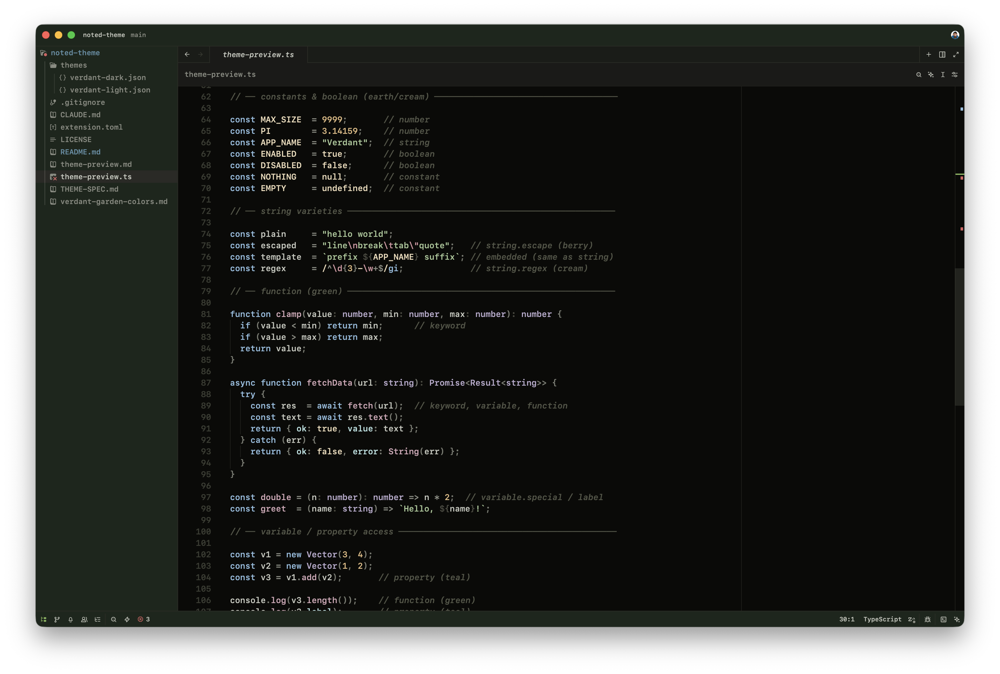
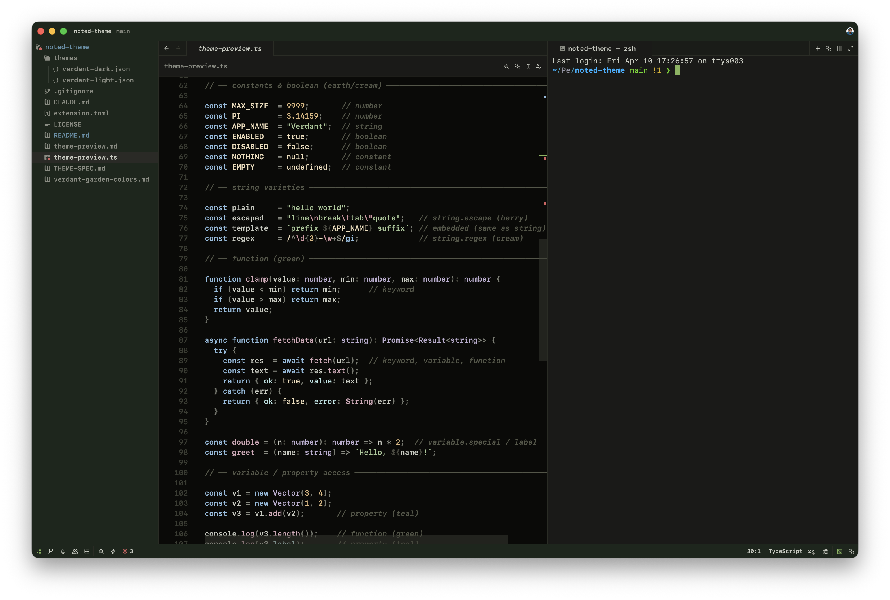
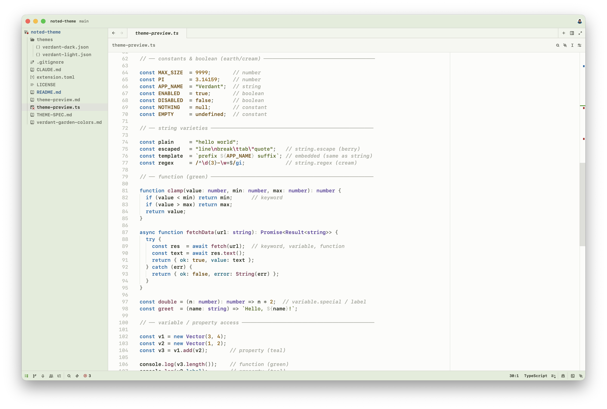
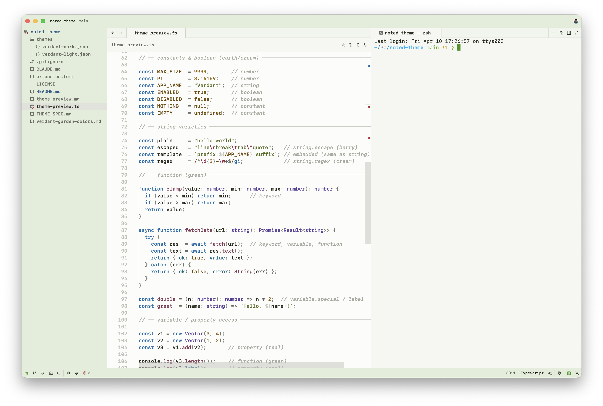

# Verdant Garden

A nature-inspired dark/light theme for Zed with full semantic token support.

Built around a hand-crafted palette of greens, teals, earthy tones, and soft berry accents — designed for both comfortable long-form reading and rich code highlighting.

## Dark





## Light





## Palette

Nine named color families, each used semantically:

| Family | Used for |
|---|---|
| Green | Headings, accents, UI chrome |
| Sky | Keywords |
| Teal | Properties, links |
| Lavender | Types, enums, constructors |
| Berry | Attributes, escape sequences, callouts |
| Sage / Olive | Strings |
| Earth | Numbers, labels |
| Amber | Inline code |
| Stone | Comments, punctuation, body text |

## Semantic tokens

Verdant Garden styles the full set of Zed semantic token types:

`keyword` `function` `type` `string` `number` `constant` `variable` `property` `operator` `comment` `comment.doc` `attribute` `tag` `enum` `constructor` `variant` `label` `embedded` `regex` `punctuation` and more — including Markdown-specific tokens for headings, links, wikilinks, tags, callouts, checkboxes, math, and frontmatter.

## Installation

### From Zed Extensions

Open Zed → Extensions → search **Noted Theme** → Install

### Dev mode

```
git clone https://github.com/sergeevav/noted-theme
```

In Zed: `Cmd+Shift+P` → `zed: install dev extension` → select the cloned folder.

## License

MIT
